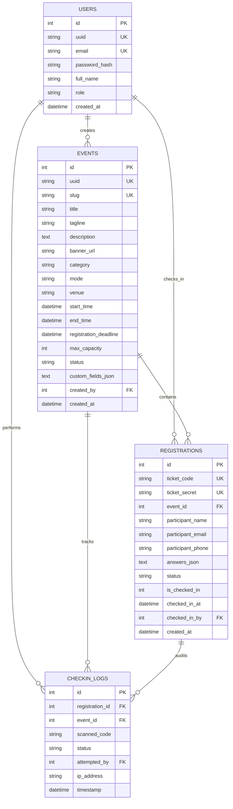

# Coders Era Event Platform — Technical Architecture (MVP)

This document specifies the system architecture, database design, cryptographic verification protocol, API contracts, and security models of the **Coders Era Event Platform**.

---

## 1. System Architecture Overview

The system is built as a lightweight, modular **Python Flask 3.x** web application backed by an embedded **SQLite** database with WAL (Write-Ahead Logging) enabled. The client layer is implemented in **Modern Vanilla HTML5, CSS3, and ES6 JavaScript** with no heavyweight build steps or external bundlers.

> [!NOTE]
> **Environment & Technology Selection:**
> Although both Node v24.21.0 and npm 11.19.0 (via `npm.cmd`) are installed and verified alongside Python 3.14.5 on the host system, Python Flask + SQLite was selected deliberately as the primary architecture. It minimizes setup friction, avoids build toolchain dependencies, and provides an elegant, deadline-friendly solution suitable for college evaluations.
>
> The public website `codersera.in` is utilized strictly as an external, read-only design and aesthetic reference.

```
+-------------------------------------------------------------------------+
|                              CLIENT LAYER                               |
|                                                                         |
|  +---------------------+   +---------------------+   +---------------+  |
|  |  Event Portal &     |   |   Dynamic Ticket    |   | Mobile Camera |  |
|  |  Registration Page  |   |   Boarding Pass     |   | QR Scanner    |  |
|  +---------------------+   +---------------------+   +---------------+  |
|                                                                         |
|  +-------------------------------------------------------------------+  |
|  |        Organizer Admin Dashboard & Live Telemetry Console         |  |
|  +-------------------------------------------------------------------+  |
+------------------------------------+------------------------------------+
                                     | JSON REST APIs / HTML Forms
                                     v
+------------------------------------+------------------------------------+
|                         APPLICATION LAYER (FLASK)                       |
|                                                                         |
|  +--------------------+  +--------------------+  +--------------------+ |
|  |  Auth & RBAC       |  |  Event Service     |  |  Ticket & QR Code  | |
|  |  Middleware        |  |  & Form Parser     |  |  Generator Engine  | |
|  +--------------------+  +--------------------+  +--------------------+ |
|                                                                         |
|  +--------------------+  +--------------------+  +--------------------+ |
|  |  Atomic Check-In   |  |  Audit Log         |  |  CSV Export        | |
|  |  Engine (ACID)     |  |  Recorder          |  |  Engine (MVP)      | |
|  +--------------------+  +--------------------+  +--------------------+ |
+------------------------------------+------------------------------------+
                                     | Parameterized SQL Queries
                                     v
+------------------------------------+------------------------------------+
|                       PERSISTENCE LAYER (SQLITE)                        |
|                                                                         |
|  [users]      [events]      [registrations]      [checkin_logs]         |
|  WAL Mode: High Concurrency, Fast Reads, ACID Transactions              |
+-------------------------------------------------------------------------+
```

---

## 2. Directory Structure

```
coders-era-event-platform/
├── app/
│   ├── __init__.py               # Flask app factory, config & route registration
│   ├── config.py                 # Environment configurations & secret keys
│   ├── db.py                     # SQLite connection manager, row factories, WAL setup
│   ├── schema.sql                # DDL schema definitions and indexes
│   ├── seed.py                   # Initial seed data (Admin user, demo events)
│   ├── services/
│   │   ├── __init__.py
│   │   ├── auth_service.py       # Password hashing (PBKDF2), session management
│   │   ├── event_service.py      # Event CRUD, slug generator, dynamic fields
│   │   ├── ticket_service.py     # Crypto ticket generator, QR rendering
│   │   ├── checkin_service.py    # Atomic check-in transactional logic
│   │   └── export_service.py     # CSV export generator (MVP)
│   ├── routes/
│   │   ├── __init__.py
│   │   ├── public_routes.py      # Homepage, event detail, registration, ticket view
│   │   ├── auth_routes.py        # Login, logout, session verification
│   │   ├── admin_routes.py       # Dashboard stats, participant lists, CSV export
│   │   └── checkin_routes.py     # High-speed QR/code verification endpoint
│   ├── static/
│   │   ├── css/
│   │   │   ├── main.css          # Design system, CSS variables, dark theme
│   │   │   ├── dashboard.css     # Admin dashboard layouts, stats cards, tables
│   │   │   └── ticket.css        # Boarding pass styling, print stylesheet
│   │   ├── js/
│   │   │   ├── api.js            # Fetch wrapper with error handling
│   │   │   ├── scanner.js        # html5-qrcode wrapper & manual input handler
│   │   │   ├── dashboard.js      # Telemetry updates, search filters
│   │   │   └── ticket.js         # Canvas/DOM PNG export and print triggers
│   │   └── vendor/
│   │       └── html5-qrcode.min.js # Vendored zero-dependency QR scanner library
│   └── templates/
│       ├── base.html             # Common layout with navigation and footer
│       ├── index.html            # Event discovery & community hero
│       ├── event_detail.html     # Event landing page with registration form
│       ├── ticket_view.html      # Digital badge / boarding pass
│       ├── admin/
│       │   ├── login.html        # Organizer login portal
│       │   ├── dashboard.html    # Telemetry, statistics, and quick actions
│       │   ├── events.html       # Event manager & custom field builder
│       │   ├── participants.html # Searchable participant table & CSV export
│       │   └── scanner.html      # Mobile camera QR scanner console
├── tests/
│   ├── test_checkin_concurrency.py # Multi-threaded double check-in test
│   ├── test_registration.py        # Duplicate prevention & validation tests
│   └── test_ticket_security.py     # Secret entropy and lookup tests
├── run.py                        # Application entry point
├── requirements.txt              # Minimal Python dependencies
├── README.md                     # Setup guide, run instructions, college viva notes
├── PROJECT_SPEC.md               # Product specification
├── ARCHITECTURE.md               # This document
├── TODO.md                       # Task tracker & roadmap
└── DECISIONS.md                  # Architectural Decision Records (ADRs)
```

---

## 3. Database Design & Relational Schema

### 3.1 Entity Relationship Diagram (ERD)



### 3.2 SQL Schema DDL (Data Definition Language)

```sql
PRAGMA journal_mode = WAL;
PRAGMA foreign_keys = ON;

-- Users Table
CREATE TABLE IF NOT EXISTS users (
    id INTEGER PRIMARY KEY AUTOINCREMENT,
    uuid TEXT UNIQUE NOT NULL,
    email TEXT UNIQUE NOT NULL COLLATE NOCASE,
    password_hash TEXT NOT NULL,
    full_name TEXT NOT NULL,
    role TEXT CHECK(role IN ('admin', 'organizer', 'volunteer')) DEFAULT 'organizer',
    created_at DATETIME DEFAULT CURRENT_TIMESTAMP,
    updated_at DATETIME DEFAULT CURRENT_TIMESTAMP
);

-- Events Table
CREATE TABLE IF NOT EXISTS events (
    id INTEGER PRIMARY KEY AUTOINCREMENT,
    uuid TEXT UNIQUE NOT NULL,
    slug TEXT UNIQUE NOT NULL COLLATE NOCASE,
    title TEXT NOT NULL,
    tagline TEXT,
    description TEXT,
    banner_url TEXT,
    category TEXT DEFAULT 'Hackathon',
    mode TEXT CHECK(mode IN ('offline', 'online', 'hybrid')) DEFAULT 'offline',
    venue TEXT NOT NULL,
    start_time DATETIME NOT NULL,
    end_time DATETIME NOT NULL,
    registration_deadline DATETIME NOT NULL,
    max_capacity INTEGER DEFAULT 0,
    status TEXT CHECK(status IN ('draft', 'published', 'closed', 'archived')) DEFAULT 'published',
    custom_fields_json TEXT DEFAULT '[]',
    created_by INTEGER NOT NULL,
    created_at DATETIME DEFAULT CURRENT_TIMESTAMP,
    updated_at DATETIME DEFAULT CURRENT_TIMESTAMP,
    FOREIGN KEY(created_by) REFERENCES users(id) ON DELETE RESTRICT
);

-- Registrations Table
CREATE TABLE IF NOT EXISTS registrations (
    id INTEGER PRIMARY KEY AUTOINCREMENT,
    ticket_code TEXT UNIQUE NOT NULL,
    ticket_secret TEXT UNIQUE NOT NULL,
    event_id INTEGER NOT NULL,
    participant_name TEXT NOT NULL,
    participant_email TEXT NOT NULL COLLATE NOCASE,
    participant_phone TEXT,
    answers_json TEXT DEFAULT '{}',
    status TEXT CHECK(status IN ('confirmed', 'cancelled', 'waitlisted')) DEFAULT 'confirmed',
    is_checked_in INTEGER DEFAULT 0 CHECK(is_checked_in IN (0, 1)),
    checked_in_at DATETIME DEFAULT NULL,
    checked_in_by INTEGER DEFAULT NULL,
    created_at DATETIME DEFAULT CURRENT_TIMESTAMP,
    updated_at DATETIME DEFAULT CURRENT_TIMESTAMP,
    FOREIGN KEY(event_id) REFERENCES events(id) ON DELETE CASCADE,
    FOREIGN KEY(checked_in_by) REFERENCES users(id) ON DELETE SET NULL,
    UNIQUE(event_id, participant_email)
);

-- Checkin Audit Logs Table
CREATE TABLE IF NOT EXISTS checkin_logs (
    id INTEGER PRIMARY KEY AUTOINCREMENT,
    registration_id INTEGER,
    event_id INTEGER NOT NULL,
    scanned_code TEXT NOT NULL,
    status TEXT CHECK(status IN ('SUCCESS', 'ALREADY_USED', 'INVALID_TICKET', 'EVENT_MISMATCH')) NOT NULL,
    attempted_by INTEGER NOT NULL,
    ip_address TEXT,
    timestamp DATETIME DEFAULT CURRENT_TIMESTAMP,
    FOREIGN KEY(registration_id) REFERENCES registrations(id) ON DELETE SET NULL,
    FOREIGN KEY(event_id) REFERENCES events(id) ON DELETE CASCADE,
    FOREIGN KEY(attempted_by) REFERENCES users(id) ON DELETE RESTRICT
);

-- Performance Indexes for Fast Verification
CREATE INDEX IF NOT EXISTS idx_users_email ON users(email);
CREATE INDEX IF NOT EXISTS idx_events_slug ON events(slug);
CREATE INDEX IF NOT EXISTS idx_reg_ticket_code ON registrations(ticket_code);
CREATE INDEX IF NOT EXISTS idx_reg_ticket_secret ON registrations(ticket_secret);
CREATE INDEX IF NOT EXISTS idx_reg_event_lookup ON registrations(event_id, is_checked_in);
CREATE INDEX IF NOT EXISTS idx_logs_event ON checkin_logs(event_id, timestamp DESC);
```

---

## 4. Cryptographic Ticket Architecture & Atomic Check-In Protocol

### 4.1 Ticket Code & Secret Generation
1. **Public Ticket Code (`ticket_code`):** Human-readable string formatted as `CE-XXXX-XXXX-XXXX` (using uppercase random hex). Designed for clear verbal reading and manual desk entry.
2. **Cryptographic Secret (`ticket_secret`):** 32-byte URL-safe cryptographic token (256 bits of entropy). Embedded in the QR code to eliminate URL enumeration or guessing.

### 4.2 Race-Condition-Proof Atomic Check-In
To satisfy the strict constraint: **"Once a ticket is checked in, it must NEVER be accepted again for the same event"**:

```sql
-- Single Atomic Statement inside an immediate transaction:
UPDATE registrations
SET is_checked_in = 1,
    checked_in_at = CURRENT_TIMESTAMP,
    checked_in_by = :user_id,
    updated_at = CURRENT_TIMESTAMP
WHERE id = :ticket_id
  AND is_checked_in = 0;
```

- **If `cursor.rowcount == 1`:** Exactly one process transitions state from `0` to `1`. Verification succeeds (`200 SUCCESS`).
- **If `cursor.rowcount == 0`:** Any concurrent or subsequent scan fails (`409 CONFLICT: ALREADY_USED`), returning the exact timestamp of prior check-in.

---

## 5. REST API Specifications (MVP Scope)

### 5.1 Authentication
- `POST /api/auth/login` — Authenticates organizer, sets session cookie.
- `POST /api/auth/logout` — Destroys session.
- `GET  /api/auth/me` — Returns current logged-in user profile.

### 5.2 Public Event & Registration
- `GET  /api/events` — Lists published events.
- `GET  /api/events/<slug>` — Returns full event details with custom form fields.
- `POST /api/events/<slug>/register` — Registers attendee, validates uniqueness, returns ticket data and QR code.
- `GET  /api/tickets/<ticket_code>` — Retrieves public ticket data for badge rendering.

### 5.3 Gate Check-In & Verification
- `POST /api/checkin/verify` — Validates Ticket Code or QR Secret Token atomically.
  - Supports fast verification suitable for real-time check-in.
  - Returns `200 SUCCESS` or `409 ALREADY_USED` / `404 NOT_FOUND` / `400 EVENT_MISMATCH`.

### 5.4 Admin Telemetry & Participant Management
- `GET /api/admin/events/<id>/stats` — Live statistics: total, checked-in, pending, attendance percentage.
- `GET /api/admin/events/<id>/participants` — Searchable and filterable participant list.
- `GET /api/admin/events/<id>/export?format=csv` — Downloads complete participant roster as CSV.
